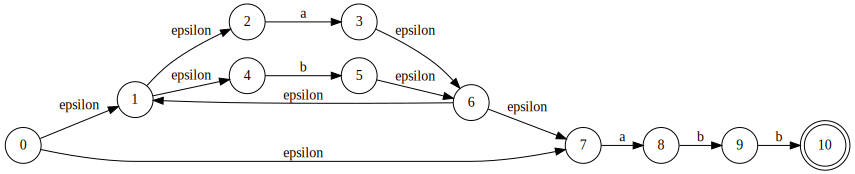
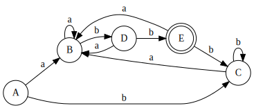

# __METODO DE THOMPSON__
---

El algoritmo Thompson (también conocido como método de Thompson) creado por Ken Thompson y Dennis Ritchie, sirve para obtener autómatas finitos no deterministas con transiciones vacías (AFND-ε) a partir de expresiones regulares (ER).

## __EJEMPLO 1__
---
## __Diagrama AFN__
>

## __Tabla de transiciones__
|              Estado                 |           a          |            b          |
|:-----------------------------------:|:--------------------:|:---------------------:|
| A = ε(0) = {1,2,4,7}                | Mov(A,a) = {3,8} = B | Mov(A,b) = {5} = C    |
| B = ε(3) U ε(8) = {1,2,3,4,6,7,8}   | Mov(B,a) = {3,8} = B | Mov(B,b) = {5,9} = D  |
| C = ε(5) = {1,2,4,5,6,7}            | Mov(C,a) = {3,8} = B | Mov(C,b) = {5} = C    |
| D = ε(5) U ε(9) = {1,2,4,5,6,7,9}   | Mov(D,a) = {3,8} = B | Mov(D,b) = {5,10} = E |
| E = ε(5) U ε(10) = {1,2,4,5,6,7,10} | Mov(E,a) = {3,8} = B | Mov(E,b) = {5} = C    |

## __Resumen de tabla de transiciones__
| Estado | a | b |
|:------:|:-:|:-:|
| A      | B | C |
| B      | B | D |
| C      | B | C |
| D      | B | E |
| E      | B | C |

## __Diagrama AFD__
>
