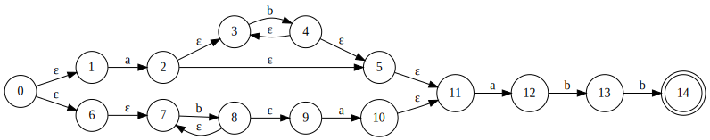
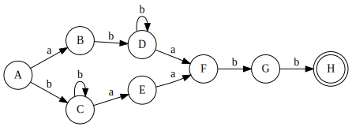

## __EJEMPLO 2__
---
## __Expresion regulasr__
```sh
(ab*|b+a)abb
```

## __Diagrama AFN__
>

## __Tabla de transiciones__
|              Estado                 |           a          |            b          |
|:-----------------------------------:|:--------------------:|:---------------------:|
| A = ε(0) = {0,1,6,7}                | Mov(A,a) = {2} = B   | Mov(A,b) = {8} = C    |
| B = ε(2) = {2,3,5}                  |                      | Mov(B,b) = {4} = D    |
| C = ε(8) = {7,8,9}                  | Mov(C,a) = {10} = E  | Mov(C,b) = {8} = C    |
| D = ε(4) = {3,4,5,11}               | Mov(D,a) = {12} = F  | Mov(D,b) = {4} = D    |
| E = ε(10) = {10,11}                 | Mov(E,a) = {12} = F  |                       |
| F = ε(12) = {12}                    |                      | Mov(F,b) = {13} = G   |
| F = ε(13) = {13}                    |                      | Mov(G,b) = {14} = H   |

## __Resumen de tabla de transiciones__
| Estado | a | b |
|:------:|:-:|:-:|
| A      | B | C |
| B      |   | D |
| C      | E | C |
| D      | F | D |
| E      | F |   |
| F      |   | G |
| G      |   | H |
| H      |   |   |

## __Diagrama AFD__
>