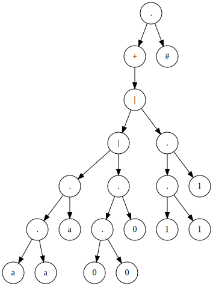
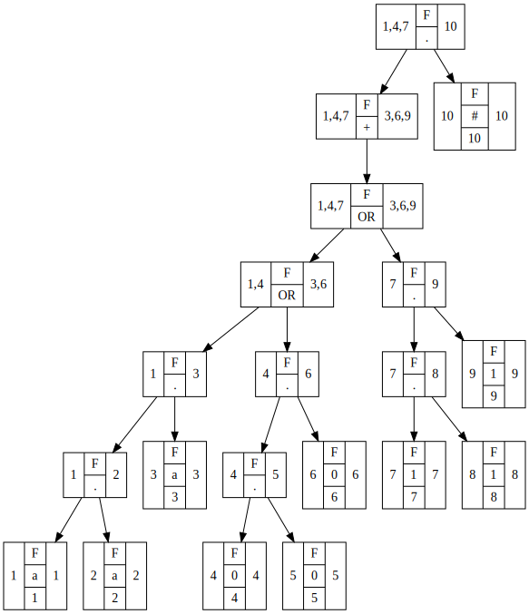
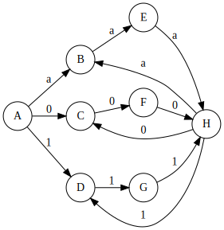

# __METODO DEL ARBOL__
## __Expresion regular__
```sh
( a a a | 0 0 0 | 1 1 1 )+ 
```
## __Expresion regular ampliada__
```sh
( a a a | 0 0 0 | 1 1 1 )+ #
```
## __Construccion del arbol__
>

## __Arbol con anulables__
>

## __Tabla de siguientes__
| Valor | Nodo i | siguientes(i) |
|:-----:|:------:|:-------------:|
| a     | 1      | 2             |
| a     | 2      | 3             |
| a     | 3      | 1,4,7,10      |
| 0     | 4      | 5             |
| 0     | 5      | 6             |
| 0     | 6      | 1,4,7,10      |
| 1     | 7      | 8             |
| 1     | 8      | 9             |
| 1     | 9      | 1,4,7,10      |
| #     | 10     |               |

## __Metodo de subconjuntos__
| Estado         | a              | 0              | 1              |
|:--------------:|:--------------:|:--------------:|:--------------:|
| A = {1,4,7}    | {2} = B        | {5} = C        | {8} = D        |
| B = {2}        | {3} = E        |                |                |
| C = {5}        |                | {6} = F        |                |
| D = {8}        |                |                | {9} = G        |
| E = {3}        | {1,4,7,10} = H |                |                |
| F = {6}        |                | {1,4,7,10} = H |                |
| G = {9}        |                |                | {1,4,7,10} = H |
| H = {1,4,7,10} | {2} = B        | {5} = C        | {8} = D        |

## __AFD__
>

